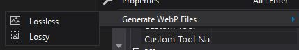

# WebP Toolkit
A Visual Studio Extension that enhances WebP support.

Download this extension from the [VS Marketplace](https://marketplace.visualstudio.com/items?itemName=kherzog.WebpToolkit) or get the latest [CI Build](https://www.vsixgallery.com/extension/WebpToolkit.3c6bbdde-9aa2-4b8a-b6e8-732cf3bfac87)

---
## Features
- Generate WebP images from existing image files
- Convert HTML `img` tags to WebP formatted `picture` tags.

## Generate WebP Image Files
Select the image file in the Solution Explorer and right-click.  Then, select Generate WebP Files and either the Best Quality or Best Compression option.

Batch WebP file generation is available by selecting the same context menu options when a folder is selected.

### Configuration
Configuration of the WebP file generation can be set in the Visual Studio Tools > Options > WebP Toolkit dialog. Included are the ability to adjust the compression levels and whether or not to overwrite existing WebP files.

## HTML Img to Picture Tag Light Bulb
HTML `img` tags can be easily converted to `picture` tags that are configured to display the WebP version of the image.

## License
[MIT](LICENSE)